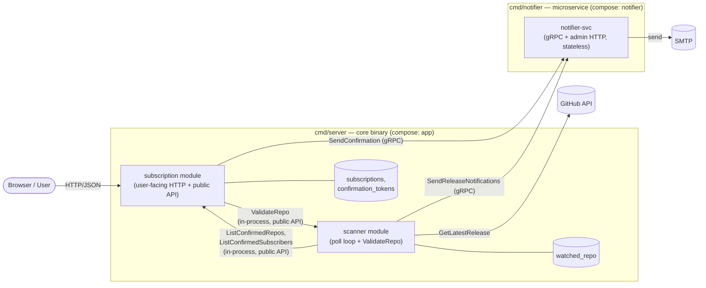

# Modular Architecture + Notifier Microservice

Status: implemented (HW7). Supersedes the single-process topology of
[ADR-003](../adr/003-service-decomposition.md) and the on-entity
`last_seen_tag` strategy of [ADR-002](../adr/002-release-detection-strategy.md);
the superseding decision is [ADR-012](../adr/012-modular-architecture-and-notifier-extraction.md).

## Why

HW7 requires a **modular architecture** — domains cleanly separated, all
inter-module communication routed through **public APIs** — **and** at least one
domain extracted into a **separate microservice**. A pure modular monolith with
zero extracted services does not satisfy the requirement; a full three-service
split is disproportionate for a two-table, low-RPS, 5-minute-poll app. We take
the well-proportioned middle: **modularize all three domains internally, extract
exactly one — the notifier.**

## Units, ownership, and public APIs

Two binaries, three modules, one network boundary (core ↔ notifier).

| Unit | Owns | Public API | External dep | Binary |
|---|---|---|---|---|
| **subscription module** | System of record: *who wants what*. Tables `subscriptions`, `confirmation_tokens`. User-facing HTTP/JSON. | Go interface: `Subscribe`, `Confirm`, `Unsubscribe`, `ListConfirmedRepos`, `ListConfirmedSubscribers(repo)` | Postgres | `cmd/server` (core) |
| **scanner module** | Release detection: *latest tag per repo*. Table `watched_repo`. Poll loop + GitHub integration (client, rate-limit, Redis cache). | Go interface: `ValidateRepo(owner, repo)` + the poll loop | GitHub API | `cmd/server` (core) |
| **notifier-svc** | Notification delivery: render + send email. Stateless. | **gRPC** `NotifierService`: `SendConfirmation`, `SendReleaseNotifications` (batch fan-out) | SMTP | `cmd/notifier` |

The subscription and scanner modules are **co-located** in the core binary
(`cmd/server`, the compose service `app`). They never import each other's
internal packages — every cross-call goes through the Go-interface public API
above. A golangci-lint **depguard** rule enforces this (`internal/subscription`
must not import `internal/scanner`; neither module may import the notifier
service-core `internal/notifier` — only `cmd/notifier` and `bench/` may).

The notifier is **physically extracted** into its own binary/container
(`cmd/notifier`), reached only over gRPC. Its `.proto` is the single source of
truth for the one cross-process contract — no hand-maintained DTOs cross the
process boundary.

## Boundary diagram



subscription and scanner call each other on **different request paths**
(`ValidateRepo` on the subscribe path; `ListConfirmed*` on the scan path), so no
single request traverses a cycle — the bidirectional module dependency is safe.

## Inter-unit communication

- **subscription ↔ scanner (in-process):** through their Go-interface public
  APIs only. No module reaches into another module's internals.
- **core → notifier (network):** **gRPC at runtime.** An idiomatic HTTP/JSON
  variant exists **only** in the benchmark harness (`bench/`); production wires
  the gRPC client exclusively. The notifier service-core is transport-agnostic
  (no gRPC types in its signatures) — the gRPC server wraps it in production,
  the benchmark's HTTP handler wraps the same core.

### The cross-process contract (`proto/notifier.proto`)

```proto
service NotifierService {
  rpc SendConfirmation(SendConfirmationRequest) returns (SendAck);
  rpc SendReleaseNotifications(SendReleaseNotificationsRequest) returns (SendAck);
}

message SendConfirmationRequest {
  string email = 1;
  string repo = 2;
  string confirm_token = 3;
  string unsubscribe_token = 4;
}

// One detected release → fan out to all confirmed subscribers in a single call.
message SendReleaseNotificationsRequest {
  string repo = 1;
  string tag = 2;
  string notes_url = 3;
  repeated Recipient recipients = 4;
}
message Recipient {
  string email = 1;
  string unsubscribe_token = 2;
}

message SendAck { uint32 sent = 1; uint32 failed = 2; }
```

`SendReleaseNotifications` is a **batch by design**: one call per detected
`(repo, tag)` carries the whole recipient list, rather than N unary calls. It is
both the cleaner runtime contract and the payload-scaling target for the
benchmark.

## Runtime flows

**Subscribe** (user → subscription module):
1. Validate input (`owner/repo` shape, email); reject duplicates.
2. In-process `scanner.ValidateRepo(owner, repo)` (public API).
3. Create subscription + confirmation token in one DB transaction.
4. gRPC → notifier `SendConfirmation(...)`.

**Confirm / Unsubscribe:** local DB writes only — no outbound calls.

**Scan cycle** (scanner background loop, every `SCAN_INTERVAL`):
1. In-process `subscription.ListConfirmedRepos()`.
2. Per repo: GitHub `GetLatestRelease` (ETag + Redis cache).
3. If the tag differs from `watched_repo.last_seen_tag`:
   - In-process `subscription.ListConfirmedSubscribers(repo)`.
   - gRPC → notifier `SendReleaseNotifications(repo, tag, notes_url, recipients[])`.
   - Upsert `watched_repo.last_seen_tag = tag`.

## Data ownership

One Postgres instance, **module-owned tables** (co-located modules share the
instance but never each other's tables):

| Owner | Tables |
|---|---|
| subscription module | `subscriptions`, `confirmation_tokens` |
| scanner module | `watched_repo(repo PK, last_seen_tag, last_polled_at)` |
| notifier-svc | none (stateless) |

`last_seen_tag` moved **from the subscription row to per-repo in the scanner**
(`watched_repo`) — this supersedes ADR-002. The migration is additive and
forward-only (`0003_create_watched_repo`); the now-dead
`subscriptions.last_seen_tag` column is dropped in a later flagged destructive
migration. **Behavior change (accepted):** a newly-confirmed subscriber no
longer receives the *current* latest release on confirm — only releases detected
from then on.

## Resilience & internal auth

| Edge | Timeout | Degradation |
|---|---|---|
| scanner → GitHub | yes | backoff + jitter, honor rate-limit headers, skip cycle on limit, ETag + Redis cache, never crash the loop |
| notifier → SMTP | yes | log + count permanently-failing addresses, never abort the batch (no DLQ — no broker yet) |
| core → notifier (gRPC) | per-call deadline | caller surfaces the error; the scan cycle logs and continues to the next repo |

A **correlation/trace ID** is generated at the subscription HTTP edge and
carried across the gRPC hop into the notifier's logs (client interceptor →
metadata → server interceptor → context-aware slog handler).

**Internal authentication:** the notifier's gRPC server enforces a shared bearer
secret (`INTERNAL_API_TOKEN`) in request metadata, verified by a server
interceptor with a constant-time compare; a matching client interceptor on the
core attaches it to every call. This is authZ only — no transit encryption;
mTLS/mesh is the documented production upgrade path, out of scope for HW7.

## Deployment

- **One** multi-stage Dockerfile builds **both** binaries into a single image;
  `docker-compose.yml` runs that image as two services with different
  `command:` — `app` (`/app/server`) and `notifier` (`/app/notifier`). Two
  containers, a real network boundary, no duplicated build logic.
- The `notifier` service publishes **no** host port: gRPC (`:50051`) and admin
  HTTP (`:8081`) stay on the compose network. The core dials `notifier:50051`.
- **Health + metrics (no k8s probes):** each service exposes `/health`
  (compose `depends_on: service_healthy` gating) + `/metrics` (Prometheus). The
  core serves them on its Gin server; the notifier (gRPC-only) gets a small
  admin HTTP server. Prometheus scrapes both; Filebeat ships both log streams.

Bring it up:
```bash
cp .env.example .env   # fill SMTP at minimum
docker compose up -d --build
# + observability overlay:
docker compose -f docker-compose.yml -f docker-compose.observability.yml up -d --build
```

## HTTP-vs-gRPC benchmark (star task)

HTTP is **benchmark-only**; production runs on gRPC. The harness (`bench/`)
stands up — in-process over loopback — a real gRPC server and a real idiomatic
HTTP/JSON server, **both wrapping the same notifier core**, and measures the
**core ↔ notifier** boundary (the one real network boundary).

Operations, spanning the two dimensions that separate the protocols:
1. `SendReleaseNotifications` at **N = 1 / 100 / 1 000 / 10 000** recipients —
   the payload/serialization story (Protobuf vs JSON size + marshal cost on a
   growing `repeated` list).
2. `SendConfirmation` — tiny request/response — the per-call-overhead story
   (HTTP/2 binary framing vs JSON over HTTP/1.1).

Both transports run **with internal auth enabled**, persistent connection reuse,
plaintext, identical payloads — transport is the only variable. Metrics:
`ns/op`, `B/op`, `allocs/op`, and on-the-wire serialized bytes. A
`TestTransportsEquivalent` test asserts both transports return identical
`SendAck` for the same input, so any measured delta is transport-only.

**Result (measured — Apple M1 Pro, Go 1.26.2):** the comparison is genuinely
two-sided, not "gRPC always wins":
- **Tiny payloads:** HTTP/JSON is marginally *faster* (≈60 µs vs gRPC ≈88 µs on
  `SendConfirmation`) — on loopback, gRPC's HTTP/2 framing + interceptor chain
  cost more per call than a pooled keep-alive HTTP/1.1 connection.
- **Larger payloads:** gRPC overtakes around **N ≈ 100** and leads modestly
  (~3–12%) up to N = 10 000.
- **Wire size:** Protobuf is consistently **~1.47–1.60× smaller** than JSON at
  every size — the one size-independent gRPC win.

At this app's real scale the latency delta is small either way, so the genuine
decision drivers for gRPC are **typed contracts + tooling/debuggability +
HW8-readiness**, not raw throughput — and gRPC is what we run.

→ Full numbers, methodology, and how to reproduce: **[`bench/README.md`](../../bench/README.md)**.

## Rejected alternatives (summary)

- **Pure modular monolith, zero services** — non-compliant with HW7.
- **Full three-service split** — exceeds "at least one"; adds a second Postgres,
  a bidirectional cross-process dependency, and a deeper test matrix for
  isolation benefits that don't bite at this scale.
- **Extract scanner instead of notifier** — scanner is stateful, has inbound
  deps (`ValidateRepo`), and a bidirectional call pattern; notifier is a
  stateless pure sink and the natural future async consumer.
- **HTTP as a permanent runtime transport** — HTTP earns only enough
  implementation to be benchmarked; maintaining it in production is dead weight.

See [ADR-012](../adr/012-modular-architecture-and-notifier-extraction.md) for the
full decision record.
