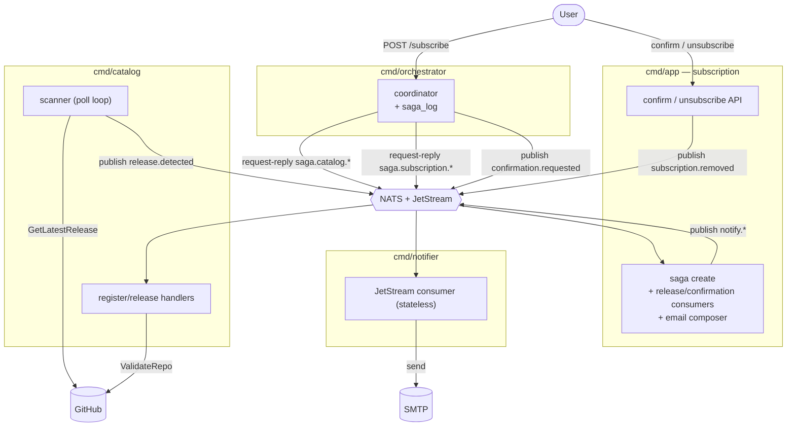

# Microservices Topology

The system is **four services from one Go module**, coordinated over a **NATS + JetStream**
broker:

- **orchestrator** (`cmd/orchestrator`) — drives the subscribe **saga**; owns a `saga_log`, no business data.
- **subscription** (`cmd/app`) — subscriptions + tokens, email composition, confirm/unsubscribe API.
- **catalog** (`cmd/catalog`) — watched-repo registry + the release scanner; GitHub client + cache.
- **notifier** (`cmd/notifier`) — stateless email delivery.

Each stateful service owns **its own Postgres** (no shared database — that is what makes a
*cross-service* subscribe a distributed transaction rather than a local one). Boundary
rationale: [ADR-012](adr/012-notifier-service-boundary.md). Broker: [ADR-013](adr/013-message-broker-nats-jetstream.md).
Distributed-transaction strategy (the saga): [ADR-014](adr/014-cross-service-transaction-strategy.md).

> Earlier revisions were a modular core + notifier over the broker. ADR-014 splits the
> watched-repo/scanner concern out into Catalog and puts a standalone orchestrator in
> front, because "subscribe" now writes to two separate databases.

## Units

| Unit | Owns (DB) | Public surface | External deps |
|---|---|---|---|
| **orchestrator** (`cmd/orchestrator`) | `saga_log` (own Postgres) — no business data | HTTP `POST /subscribe` | NATS (request-reply + publish) |
| **subscription** (`cmd/app`) | `subscriptions`, `confirmation_tokens` + email composition (templates/links) | HTTP confirm / unsubscribe / list | Postgres, NATS |
| **catalog** (`cmd/catalog`) | `watched_repos`, `repo_registrations` | NATS handlers (+ admin `/metrics`) | Postgres, Redis (cache), GitHub API, NATS |
| **notifier** (`cmd/notifier`) | — (stateless) | NATS subscription (+ admin `/metrics`) | NATS, SMTP |

## Transport split

Two NATS styles, by job:

- **Core NATS request-reply** carries the **saga commands + compensation** — the
  orchestrator needs an immediate ok/fail reply to decide commit-vs-compensate:
  `saga.catalog.register` / `saga.catalog.release` and `saga.subscription.create`.
- **JetStream** carries the durable, fire-and-forget **events + emails**:
  `events.release.detected`, `events.subscription.removed`, `events.confirmation.requested`
  (stream `EVENTS`), and `notify.confirmation` / `notify.release` (stream `NOTIFICATIONS`,
  DLQ `NOTIFY_DLQ`).

## Boundary



During the saga the two participants **never talk to each other** — only the orchestrator
talks to each (the defining trait of an *orchestrated* saga). The one cross-participant
edge, `release.detected`, lives outside the saga.

## The subscribe saga

`POST /subscribe` is the orchestrator's. It runs three zones (full rationale: ADR-014):

```
── BEFORE PIVOT (compensatable) ───────────────────────────────
 A  saga.catalog.register   validate on GitHub, register repo     comp: saga.catalog.release
── PIVOT (the commit point — no compensation) ─────────────────
 B  saga.subscription.create  INSERT subscription + token in one local tx
── AFTER PIVOT (terminal, retriable, never compensated) ────────
 C  publish events.confirmation.requested   (only after saga_log = COMMITTED)
       → subscription service renders + publishes notify.confirmation → notifier → SMTP
```

- **A fails** → abort, nothing created.
- **B fails** → compensate A (`release`), no email. **The compensation that fires in practice.**
- **A + B succeed** → `COMMITTED` → emit the confirmation event.
- **Crash** → the `saga_log` recovery sweep compensates before the pivot and rolls forward
  after it; the confirmation re-publish is deduplicated.

The `subscription_id` (a UUID the orchestrator mints) is the cross-service identity that
keeps `register` / `release` and `create` **idempotent** under retries and recovery.

## Other flows

- **Confirm / unsubscribe** — local DB writes on the subscription service over synchronous
  HTTP. Unsubscribe additionally emits `events.subscription.removed`; Catalog consumes it
  and releases the registration (eventual cleanup, **not a saga** — ADR-014).
- **Scan cycle** (every `SCAN_INTERVAL`, in Catalog) — poll active repos → on a new tag,
  advance the cursor and **publish one `release.detected`**. The subscription service
  consumes it, resolves confirmed subscribers, and fans out one `notify.release` per
  recipient (the scanner no longer reads subscriptions — it is the detector, not the
  address book).

## Resilience & delivery semantics

- **Saga commands**: synchronous, bounded by a per-command timeout; durability comes from
  the `saga_log` (recovery sweep on boot + ticker), not the broker.
- **Events + emails**: JetStream **at-least-once** with a durable file-backed buffer. Ack
  after success; transient failure → `nak` → redeliver after `AckWait`; permanent / exhausted
  → `term`. The `notify.*` consumer additionally dead-letters to `NOTIFY_DLQ`. Publish dedup
  via `Nats-Msg-Id` absorbs retries.
- A consumer outage **delays** delivery, it doesn't lose it; clients reconnect indefinitely.

NATS runs unauthenticated on the compose network (same posture as ADR-013); accounts/creds
+ TLS are the documented production upgrade.

## Observability

- **Metrics** — the notifier exposes `notify_messages_total{subject,outcome}` /
  `notify_send_duration_seconds` on its admin `/metrics`; Catalog exposes `/metrics` too.
- **Logs / tracing** — a saga id ties a subscribe across services; every publish/send logs
  an `event_id`. Filebeat ships all services' logs to Elasticsearch ([ADR-010](adr/010-log-shipping-pipeline.md)).
- **Stuck work** — sagas lingering in non-terminal `saga_log` states (a participant outage),
  or messages in `NOTIFY_DLQ` (a bad address / malformed payload).

## Deployment

One multi-stage Dockerfile builds all four binaries; `docker-compose.yml` runs them
alongside `nats`, `redis`, and **three Postgres instances** (`db-subscription`,
`db-catalog`, `db-orchestrator`). The orchestrator serves `POST /subscribe` on `:8090`;
the subscription service serves the confirm/unsubscribe API on `:8080`; catalog + notifier
expose only admin `/metrics`.

```bash
cp .env.example .env   # set SMTP_*
docker compose up -d --build
```
