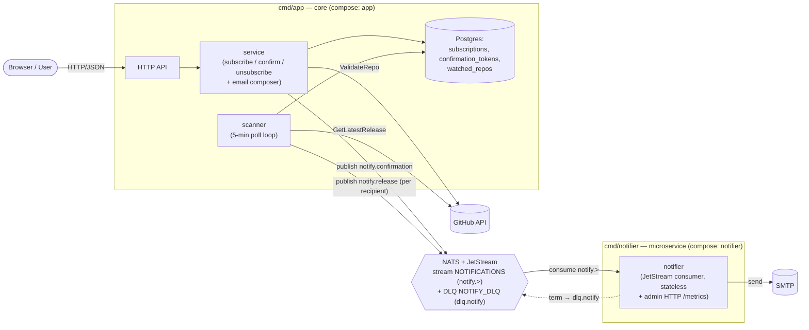

# Microservices: the Notifier Boundary

The system is a **modular core** (`cmd/app`) plus **one extracted microservice** — the
notifier (`cmd/notifier`) — reached **asynchronously over a NATS + JetStream broker**.
This is the proportionate split for a two-table, low-RPS, 5-minute-poll app: modularize
internally, extract only the one domain that earns a process boundary. Boundary rationale:
[ADR-012](adr/012-notifier-service-boundary.md). Broker (the app↔notifier transport):
[ADR-013](adr/013-message-broker-nats-jetstream.md).

> These were previously connected over synchronous gRPC; this design replaces that hop
> with the broker below. ADR-012's gRPC transport is superseded by ADR-013; the
> *boundary* it defined (two binaries, stateless notifier) still holds.

## Units

Two binaries from one Go module; one async boundary (app → NATS → notifier).

| Unit | Owns | Public surface | External deps |
|---|---|---|---|
| **core** (`cmd/app`) | Subscriptions + tokens, release scanning, **email composition** (templates + links). Layered `api → service → repository` (ADR-007). | User-facing HTTP/JSON | Postgres, Redis (cache), GitHub API, **NATS (publish)** |
| **notifier** (`cmd/notifier`) | Email **delivery** only — stateless JetStream consumer. | NATS subscription (+ admin HTTP `/metrics`) | **NATS (consume)**, SMTP |

The core **renders** every email — subject, HTML, confirm/unsubscribe links via
`BASE_URL` — and publishes a finished message; the notifier is a dumb SMTP sink that
delivers it. No templates or business logic cross the wire, only a rendered email.

## Boundary



Every runtime edge points core → NATS → notifier: the notifier never calls back into the
core (no cycle). Confirm/unsubscribe are local DB writes over synchronous HTTP — only the
*email-producing triggers* become async events.

## The contract (`internal/shared/notify`)

A JSON command, shared by both sides (no DTOs cross a hand-maintained line):

```go
type EmailCommand struct {
    EventID        string `json:"event_id"`        // correlation id: publish ↔ consume
    RecipientEmail string `json:"recipient_email"`
    Subject        string `json:"subject"`
    HTMLBody       string `json:"html_body"`
}
```

| Subject | Published when | `Nats-Msg-Id` (dedup) |
|---|---|---|
| `notify.confirmation` | a subscription is created (1 per subscribe) | `confirmation:<token>` |
| `notify.release` | a new release is detected (1 **per recipient**) | `release:<repo>:<tag>:<email>` |

The payload is **already rendered** core-side, so the notifier needs no templates and no
domain knowledge. Code is split by owner: shared connect/stream setup in
`internal/shared/natsbus`, the publisher in `internal/app/natspublisher`, the consumer in
`internal/notifier` — see `internal/shared/natsbus/CLAUDE.md`.

## Runtime flows

- **Subscribe** — validate → `ValidateRepo` (GitHub) → write subscription + token in one
  DB transaction → render confirmation → **publish `notify.confirmation`** → return.
- **Confirm / Unsubscribe** — local DB writes only; no broker.
- **Scan cycle** (every `SCAN_INTERVAL`) — list confirmed repos → per repo
  `GetLatestRelease` (Redis-cached) → if the tag moved past `watched_repos.last_seen_tag`:
  load confirmed subscribers, render + **publish one `notify.release` per recipient**,
  advance the per-repo cursor. An unchanged tag does **zero** subscriber reads.
- **Deliver** (notifier) — consume each command → SMTP send → ack.

## Resilience & delivery semantics

JetStream gives **at-least-once** with a durable buffer (file storage):

- Ack only after a successful send. Transient failure → `nak` → redeliver after `AckWait`
  (30 s), up to `MaxDeliver` (5).
- Permanent failure (malformed payload) or exhausted retries → `term` → republish to
  `dlq.notify` (the durable `NOTIFY_DLQ` stream). **The DLQ is the durable failure
  ledger.**
- A notifier outage **delays** delivery (messages buffer on the stream), it doesn't lose
  it. The client reconnects forever (`MaxReconnects(-1)`) so a >2-min broker blip doesn't
  silently kill the consumer.
- **Publish dedup** via `Nats-Msg-Id` absorbs producer retries / scanner re-runs.
- **Delivery is at-least-once** — a crash between SMTP-accept and ack can resend (accepted
  tradeoff, ADR-013). The prior at-most-once gap (ADR-006) is closed.

No internal bearer auth on the hop anymore (it left with gRPC); NATS runs on the compose
network. Production hardening (NATS accounts/credentials + TLS) is the documented upgrade.

## Observability

- **Metrics** — the notifier exposes `notify_messages_total{subject,outcome}` and
  `notify_send_duration_seconds` on its admin `/metrics`; Prometheus scrapes
  `notifier:9091`. DLQ rate = `outcome="term"`.
- **Logs / tracing** — every publish and successful send logs an `event_id`; Filebeat
  ships both services' logs to Elasticsearch, so "trace one release end-to-end" is a
  single Kibana filter on `event_id` (or `repo`). See [ADR-010](adr/010-log-shipping-pipeline.md).
- **Failure runbook** — inspect `dlq.notify` (`nats stream view NOTIFY_DLQ` or Kibana for
  the `dead-lettering` log), fix the cause, redrive (re-publish to `notify.*`).

## Deployment

One multi-stage Dockerfile builds both binaries; `docker-compose.yml` runs them as `app`
+ `notifier` alongside `nats`. The notifier publishes no host port — it consumes from NATS
and serves `/metrics` on its admin port (`:9091`). Both services take `NATS_URL` and
`depends_on: nats (service_healthy)`. The app serves `/health` + `/metrics` on `:8080`.
Prometheus scrapes `app:8080` and `notifier:9091`; Filebeat ships both containers' logs to
Elasticsearch.

```bash
cp .env.example .env   # set SMTP_*
docker compose up -d --build
```
