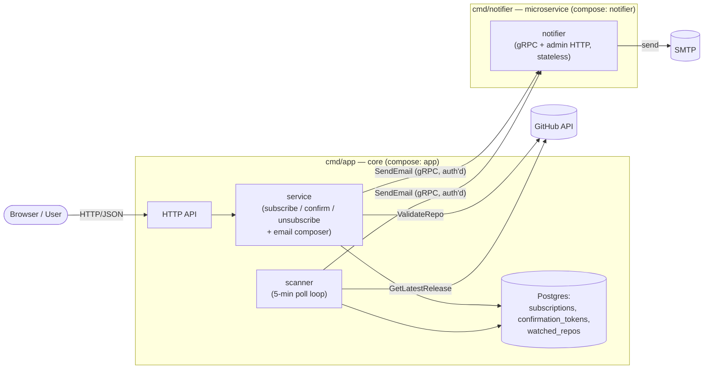

# Microservices: the Notifier Boundary

The system is a **modular core** (`cmd/app`) plus **one extracted microservice** — the
notifier (`cmd/notifier`) — reached over gRPC. This is the proportionate split for a
two-table, low-RPS, 5-minute-poll app: modularize internally, extract only the one
domain that earns a process boundary. Decision and rationale:
[ADR-012](adr/012-notifier-service-boundary.md).

## Units

Two binaries from one Go module; one network boundary (app ↔ notifier).

| Unit | Owns | Public surface | External deps |
|---|---|---|---|
| **core** (`cmd/app`) | Subscriptions + tokens, release scanning, **email composition** (templates + links). Layered `api → service → repository` (ADR-007). | User-facing HTTP/JSON | Postgres, Redis (cache), GitHub API |
| **notifier** (`cmd/notifier`) | Email **delivery** only — stateless. | gRPC `SendEmail` (+ admin HTTP `/metrics`) | SMTP |

The core **renders** every email — subject, HTML, confirm/unsubscribe links via
`BASE_URL` — and the notifier is a dumb SMTP sink that delivers a finished message.
No templates or business logic cross the wire, only a rendered email.

## Boundary



## The contract (`proto/notifier.proto`)

```proto
service NotifierService {
  rpc SendEmail(SendEmailRequest) returns (SendEmailResponse);
}
message SendEmailRequest {
  string recipient_email = 1;
  string subject = 2;
  string html_body = 3;
}
```

One unary RPC carries a fully-rendered email. `.proto` codegen is the single source of
truth for the boundary — no hand-maintained DTOs cross the process line.

## Runtime flows

- **Subscribe** — validate input → `ValidateRepo` (GitHub) → write subscription + token
  in one DB transaction → compose confirmation email → gRPC `SendEmail`.
- **Confirm / Unsubscribe** — local DB writes only; no outbound call.
- **Scan cycle** (every `SCAN_INTERVAL`) — list confirmed repos → per repo
  `GetLatestRelease` (Redis-cached) → if the tag moved past
  `watched_repos.last_seen_tag`: load confirmed subscribers, compose + gRPC `SendEmail`
  each, advance the per-repo cursor. An unchanged tag does **zero** subscriber reads —
  it just bumps `last_polled_at`.

## Resilience & internal auth (the gRPC hop)

Chained server interceptors, outermost first: **Recovery** (panic → `codes.Internal`),
**Auth** (rejected ahead of metrics, so unauthenticated calls don't skew latency),
**RequestID** (`x-request-id` propagated/minted — correlates app + notifier logs),
**Metrics** (ADR-011). Shutdown is bounded (`GracefulStop` + 8 s force-stop).

**Auth** — a shared bearer secret (`INTERNAL_API_TOKEN`) in request metadata, verified
with a constant-time compare; a client interceptor attaches it to every call. AuthZ
only, no transit encryption (mTLS/mesh is the documented production upgrade, out of
scope for HW7). Empty token = bypass (local/dev/e2e).

Per-call deadlines apply; a failed send is logged and the scan cycle continues to the
next repo. Delivery is **at-most-once** — no outbox yet (ADR-006).

## Deployment

One multi-stage Dockerfile builds both binaries; `docker-compose.yml` runs them as
`app` + `notifier`. The notifier publishes no host port — gRPC (`:9090`) and admin HTTP
(`:9091`) stay on the compose network; the core dials `notifier:9090`. `app` waits on
db + redis (`depends_on: service_healthy`) and on the notifier having started
(`service_started` — start-ordering only); it still dials the notifier lazily over gRPC,
so there is no notifier healthcheck. The app serves `/health` + `/metrics` on `:8080`; the
notifier serves `/metrics` on its admin port `:9091`. Prometheus scrapes both
(`app:8080`, `notifier:9091`); Filebeat ships both containers' logs to Elasticsearch.

```bash
cp .env.example .env   # set SMTP_* and INTERNAL_API_TOKEN
docker compose up -d --build
```

## Benchmark

`bench/` stands up a real gRPC server and an idiomatic HTTP/JSON server over loopback,
both wrapping the same notifier core, and measures the app↔notifier boundary across
payload sizes and concurrency — `make bench` (latency), `make bench-throughput`
(concurrency). Summary and numbers: [ADR-012 § Decision](adr/012-notifier-service-boundary.md#decision).
