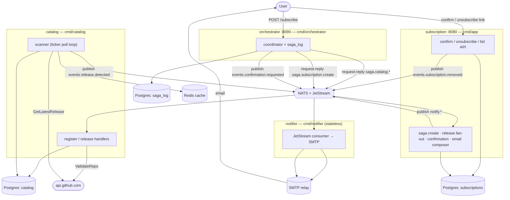
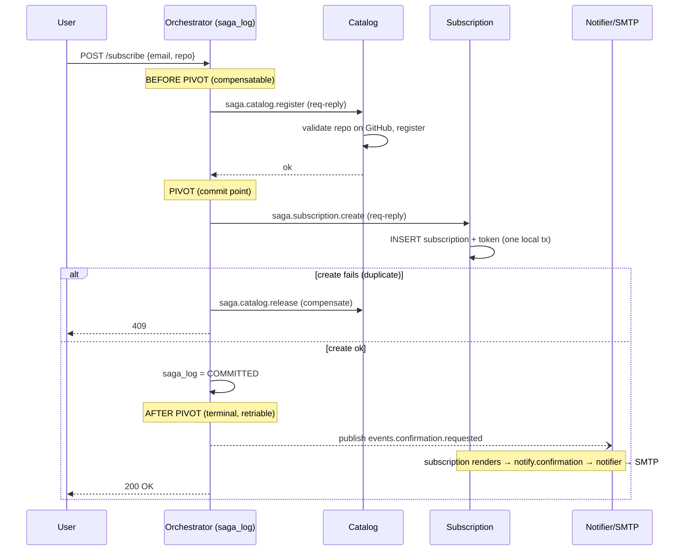
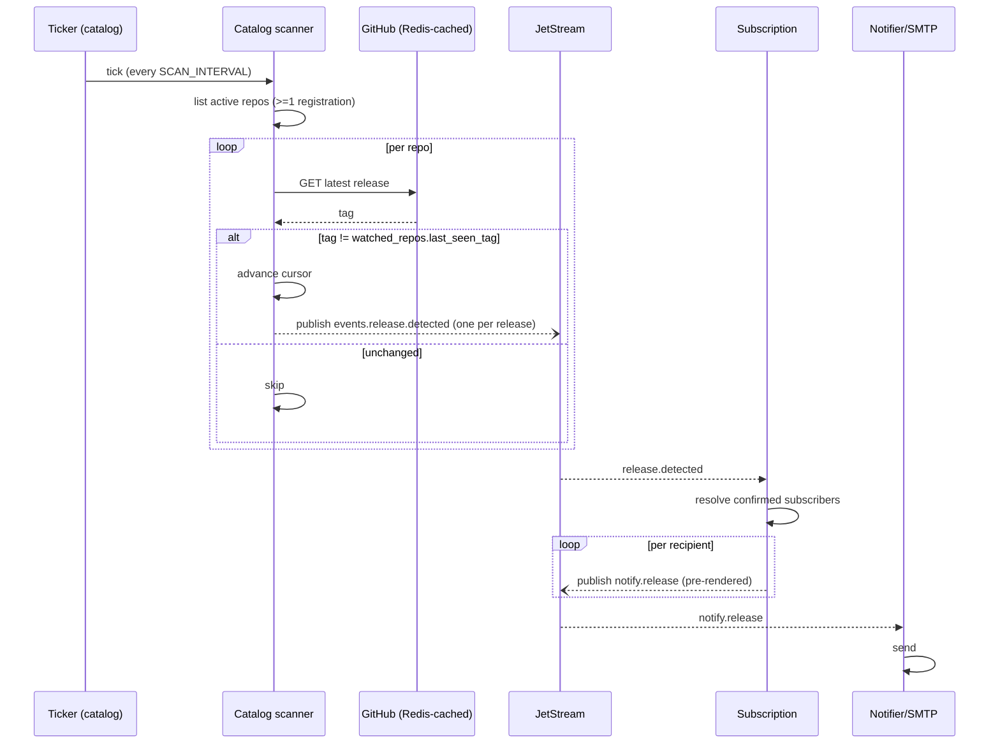
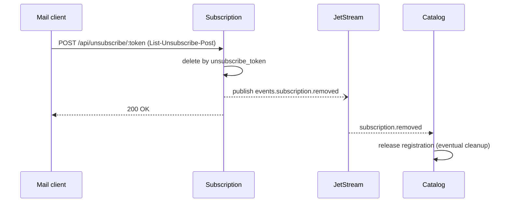

# System Design - RelEasely

## 1. Overview

A system that lets users subscribe by email to GitHub release notifications for a chosen public repository. Users confirm via a link in a confirmation email; a background scanner polls GitHub on a fixed interval and emails subscribers when a new release tag appears.

**Four services from one Go module, coordinated over a NATS + JetStream broker** — an orchestrator (the public front door, owns the subscribe saga), a subscription service (subscribers + tokens + email composition), a catalog service (watched-repo registry + the release scanner), and a stateless notifier (SMTP delivery). Each stateful service owns **its own PostgreSQL**; there is no shared database. NATS Core request-reply carries the synchronous saga commands; JetStream carries the durable events and emails. Redis optionally caches GitHub API responses. SMTP delivers mail.

The topology and message contracts are specified in [`docs/microservices.md`](microservices.md); this document gives the system-level design and defers fine-grained detail there. The two structural decisions are the broker ([ADR-013](adr/013-message-broker-nats-jetstream.md)) and the cross-service transaction strategy ([ADR-014](adr/014-cross-service-transaction-strategy.md)).

---

## 2. Goals & Non-Goals

**Goals**
- Reliable delivery of release notifications for any public GitHub repository.
- Bounded notification latency (target ≤ 1 polling interval after release publication).
- Self-service subscribe / confirm / unsubscribe with double opt-in.
- Survive GitHub rate-limit pressure and transient SMTP failures without losing subscriber state.
- Operable by one engineer; debuggable from container logs and `psql`.

**Non-Goals**
- Per-asset, per-tag-prefix, or pre-release filtering.
- Push channels other than email (no Slack, no webhook fan-out).
- Private repository support.
- Multi-region active/active.
- Exactly-once email delivery. Delivery is **at-least-once** over JetStream (a rare duplicate is accepted; see §9 and ADR-013).

---

## 3. SLOs & Capacity

| Dimension | Target |
|---|---|
| API availability | 99.5% monthly |
| API p99 latency | < 200 ms (excluding GitHub upstream calls) |
| Notification latency | ≤ `SCAN_INTERVAL` + 60 s p95 |
| Email delivery success | ≥ 99% (excluding hard bounces) |

**Capacity envelope** (single Catalog instance, single `GITHUB_TOKEN`). The ceiling is set by the **Catalog scanner's** GitHub poll budget. With `R = 5 000 req/h` (GitHub authenticated limit), `I` = scan interval in minutes, `H = 0.8` headroom for subscribe-time validation calls (which also run through Catalog's GitHub client), and `E` = ETag-304 hit ratio, the maximum distinct tracked repos is `N = R × H / (1 − E) / (60 / I)`.

| `SCAN_INTERVAL` | ETag hit ratio | Max distinct repos |
|---|---|---|
| 5 min | 0 (today) | ≈ **333** |
| 5 min | 0.95 (post-ETag) | ≈ **6 666** |
| 15 min | 0 | ≈ **1 000** |

Subscribers scale independently (DB rows, SMTP fan-out). The ceiling is **distinct repos**, not subscribers. See §10.

---

## 4. High-Level Architecture

Four services, three databases, one broker. Subscribe enters at the **orchestrator** (`:8090`); confirm/unsubscribe enter at the **subscription** service (`:8080`); **catalog** and **notifier** expose only admin `/metrics`.



During the saga the participants **never talk to each other** — only the orchestrator talks to each (the defining trait of an *orchestrated* saga). The one cross-participant edge, `release.detected`, lives outside the saga.

**Layering** is strict and identical in every service: handlers parse HTTP and map domain errors to status codes, services own business logic, repositories own SQL. Handlers never touch GORM; services never see `gin.Context`. See [`docs/microservices.md`](microservices.md) for the authoritative boundary diagram and transport split.

---

## 5. Components

Each service is a `cmd/*/main.go` composition root (its only wiring point; no DI framework) over an `internal/{service}/…` package tree. The four services and their owned data:

| Service | Binary / package | Public surface | Owns (Postgres) | Key deps |
|---|---|---|---|---|
| **orchestrator** | `cmd/orchestrator`, `internal/orchestrator` | HTTP `GET /` (form), `POST /subscribe`, `/health` (`:8090`) | `saga_log` — no business data | NATS (request-reply + publish) |
| **subscription** | `cmd/app`, `internal/app` | HTTP confirm / unsubscribe / list (`:8080`) | `subscriptions`, `confirmation_tokens` | Postgres, NATS |
| **catalog** | `cmd/catalog`, `internal/catalog` | admin `/metrics` only (`:9092`) | `watched_repos`, `repo_registrations` | Postgres, Redis, GitHub, NATS |
| **notifier** | `cmd/notifier`, `internal/notifier` | admin `/metrics` only (`:9091`) | — (stateless) | NATS, SMTP |

Internal layering is the same `api` → `service` → `repository` → `db` shape in each service, plus broker-facing packages:

| Layer | Where | Responsibility |
|---|---|---|
| **api** | `internal/{service}/api` | Gin routing, input parsing, domain-error → HTTP-status mapping. |
| **service** | `internal/orchestrator/service`, `internal/app/service` | Business logic, validation, token generation, saga sequencing. Raises domain sentinel errors. |
| **saga handlers** | `internal/app/saga`, `internal/catalog/saga` | The request-reply participants: `subscription.create` (the pivot), `catalog.register` / `catalog.release`. |
| **event consumers** | `internal/app/{releaseconsumer,confirmationconsumer}` | Consume `release.detected` (fan out one `notify.release` per recipient) and `confirmation.requested`. |
| **repository** | `internal/{service}/repository` | SQL via GORM. No business logic. Returns ORM models. |
| **db / migrations** | `internal/{service}/db` | Postgres connection + per-service forward-only migrations (golang-migrate). |
| **domain** | `internal/{service}/domain` | Leaf types + sentinel errors; imports nothing else (no cycles). |
| **GitHub client** | `internal/catalog/github` | Authenticated REST calls; rate-limit detection; optional Redis cache wrapper (`internal/catalog/cache`). |
| **scanner** | `internal/catalog/scanner` | Ticker-driven goroutine; polls active repos; publishes `release.detected` (§5.1). |
| **notifier** | `internal/notifier` | Stateless JetStream consumer → SMTP. Email templates + `List-Unsubscribe` headers live in the **subscription** service (`internal/app/templates`), which pre-renders; the notifier only delivers. |
| **shared** | `internal/shared/{saga,notify,natsbus,config,observability}` | Cross-service message contracts + subjects, the NATS connect/stream/request-reply helpers, env config, structured slog. |

### 5.1 Scanner concurrency contract (catalog)

The scanner runs inside the **catalog** service (`internal/catalog/scanner`), fed the process context.

- **Bounded fan-out.** Each tick processes repos through a worker pool of size `SCAN_CONCURRENCY` (default 8). One in-flight GitHub call per repo at a time.
- **Per-call deadline.** Every GitHub request runs under `context.WithTimeout(GITHUB_TIMEOUT)` (default 10 s). A hung repo cannot stall the tick.
- **Per-tick budget.** Total tick duration is bounded by `SCAN_INTERVAL`; if a tick exceeds `0.8 × SCAN_INTERVAL`, the next tick is skipped rather than queued.
- **Detector, not address book.** The scanner reads `watched_repos` (active repos = those with ≥ 1 registration), advances the `last_seen_tag` cursor on a new tag, and **publishes one `release.detected` event** — it never reads subscriptions. The subscription service owns the subscriber list and fans out the per-recipient emails (§8.2).
- **Panic isolation.** Each repo check is wrapped so one bad repo recovers and never kills the goroutine.
- **Single-owner invariant.** Exactly one Catalog process runs the scanner. Today Catalog is single-replica, so the invariant holds by construction. Stage 2 of §10 introduces a Postgres advisory-lock leader election (`pg_try_advisory_lock`) so Catalog workers without the lock idle.

---

## 6. Data Model

**One database per stateful service; no shared schema** — that separation is what makes a cross-service subscribe a distributed transaction rather than a local one (ADR-014). Datastore choice: **ADR-001 - Primary Datastore**. Each service runs its own forward-only migrations under `internal/{service}/db/migrations`.

**subscription** (`internal/app/db/migrations`)
- `subscriptions(id, public_id UUID, email, repo, confirmed, unsubscribe_token, created_at, updated_at)`
- `confirmation_tokens(id, token, subscription_id FK ON DELETE CASCADE, created_at)`
- `public_id` is the **orchestrator-minted UUID** — the cross-service identity that keys Catalog's registration and addresses unsubscribe. Unique indexes on `public_id` and on `(email, repo)`. Unsubscribe hard-deletes the row, so re-subscribe just inserts a fresh row (no soft-delete tombstone).
- The per-subscriber `last_seen_tag` cursor was **removed** — the release cursor now lives in Catalog, keyed per repo, not per subscription.

**catalog** (`internal/catalog/db/migrations`)
- `watched_repos(repo PK, last_seen_tag)` — the scan cursor.
- `repo_registrations(subscription_id UUID PK, repo, created_at, FK → watched_repos(repo))` — one registration per subscription; a repo is polled while it has ≥ 1.

**orchestrator** (`internal/orchestrator/db/migrations`)
- `saga_log(saga_id UUID PK, state, subscription_id UUID, payload JSONB, last_error, created_at, updated_at)` — the durable record that drives crash recovery. A partial index on unfinished states (`state NOT IN ('DONE','ABORTED','COMPENSATED')`) keeps the recovery sweep cheap.

`watched_repos.last_seen_tag` is the **dedup key**: a release is "new" iff GitHub reports a tag different from the one persisted on the repo's cursor row. One detection per repo per cycle (not per subscription); see §9 for the failure modes the notification path admits.

---

## 7. API Contract

The public HTTP surface is split across two services. Authoritative source: `swagger.yaml`.

**orchestrator** (`:8090`) — the public front door for subscribe:

| Method | Path | Purpose | Notable error mapping |
|---|---|---|---|
| `GET` | `/` | HTML subscription form (posts same-origin to `/subscribe`) | - |
| `POST` | `/subscribe` | Run the subscribe saga (validate + register repo, create subscription, queue confirmation email) | 400 invalid repo, 404 repo missing, 409 duplicate, 503 GitHub rate-limited, 500 unmapped saga failure |
| `GET` | `/health` | Liveness | - |

**subscription** (`:8080`) — confirm / unsubscribe / list, reached from email links:

| Method | Path | Purpose | Notable error mapping |
|---|---|---|---|
| `GET` | `/api/confirm/:token` | Set `confirmed=true`, delete token | 404 token unknown |
| `GET` / `POST` | `/api/unsubscribe/:token` | Delete subscription, emit `subscription.removed` | 404 token unknown |
| `GET` | `/api/subscriptions` | List active subs for an email (gated by `X-API-Key` when `API_KEY` set) | 400 invalid email, 401 bad/missing key |

The stale single-binary `/api/subscribe` is **gone** — subscribe is now the orchestrator's `POST /subscribe`, and the form moved with it. `POST` on unsubscribe exists to satisfy RFC 8058 one-click unsubscribe headers in outgoing mail. Catalog and notifier expose no public HTTP — only admin `/metrics` (§12).

---

## 8. Key Flows

Three distinct coordination shapes: subscribe is an **orchestrated saga** (two stateful writes that must be atomic-in-effect), scan+notify is **event choreography**, and unsubscribe is a **reliable event** — not a saga. The decision to reserve orchestration for subscribe alone is ADR-014.

### 8.1 Subscribe — orchestrated saga

`POST /subscribe` is the orchestrator's. It runs three zones; full rationale in ADR-014, concrete contract in [`docs/microservices.md`](microservices.md). The `subscription_id` (a UUID the orchestrator mints) is the cross-service identity that keeps every step idempotent under retries and recovery.



- **register fails** → abort, nothing created.
- **create fails** → compensate `register` (`release`), no email. The compensation that fires in practice.
- **register + create succeed** → `COMMITTED` → emit the confirmation event.
- **Crash** → the `saga_log` recovery sweep (on boot + ticker) compensates before the pivot, rolls forward after it; the confirmation re-publish is deduplicated. An email is irreversible, so it lives strictly *after* the pivot.

Confirm is a later, independent step: `GET /api/confirm/:token` on the subscription service looks up the token, flips `confirmed=true`, and deletes the token (one-shot).

### 8.2 Scan + notify — event choreography

Catalog detects; the subscription service fans out; the notifier delivers. Catalog is decoupled from all consumers — it publishes one event per release and reads no subscriptions. Durability is JetStream's: a consumer outage defers delivery, it doesn't drop it.



**Silent first scan.** A newly registered repo's cursor starts `""`; the first scan records the current tag but does **not** publish — a new subscriber shouldn't get a notification for a year-old release. From the second scan, a change fires.

### 8.3 Unsubscribe — reliable event

Deleting the subscription is the user's goal and is never rolled back; releasing the Catalog registration is idempotent cleanup that can lag. So unsubscribe is a local delete plus a `subscription.removed` event — explicitly **not** a saga (ADR-014: a "compensation" here would mean re-inserting the row the user just deleted).



Between the delete and Catalog consuming the event, the scanner may poll a now-subscriberless repo once more — benign and self-healing (ADR-014).

---

## 9. Failure Modes

| Failure | Behavior today | Mitigation / future |
|---|---|---|
| GitHub 5xx / timeout | Catalog scanner logs and moves on; subscribe saga's `register` step → 503 | Per-repo exponential backoff. |
| GitHub 429 / rate-limit | Subscribe → 503; scanner aborts the cycle (no further budget burned) | ETag / `If-None-Match` to avoid burning budget on unchanged repos. |
| One bad repo in a tick | `checkRepo` panic recovered; the goroutine survives | - |
| Saga `register` reply lost | Subscribe aborts; a registration with no subscription is left (benign leak, reclaimed on release) | Outbox / dedup sweep (ADR-014, deferred). |
| Saga `create` fails (duplicate) | Orchestrator compensates `register`; 409 to the user | - |
| Orchestrator crash mid-saga | `saga_log` recovery sweep compensates before the pivot, rolls forward after; confirmation re-publish deduplicated | - |
| Consumer (subscription/notifier) down | JetStream buffers; redelivers on reconnect — delivery delayed, not lost | - |
| Email permanently fails (bad address / malformed) | Retried a bounded number of times, then dead-lettered to `NOTIFY_DLQ` for triage | Manual redrive (ADR-013). |
| Tag changes twice within one interval | Intermediate release is lost | Acceptable per current SLO. |
| Scan duration > interval | Ticks pile up | Bound concurrency; alert on `scan_duration > 0.8 × SCAN_INTERVAL`. |

Delivery is **at-least-once** over JetStream: a successful send is acked; a transient failure is `nak`'d and redelivered after `AckWait`; a permanent/exhausted failure is `term`'d and the `notify.*` consumer dead-letters to `NOTIFY_DLQ`. Publish-side dedup (`Nats-Msg-Id`) absorbs producer retries, so a rare duplicate — not loss — is the accepted tradeoff (ADR-013).

### 9.1 Cursor-advance vs. email-send ordering

The release path has two non-atomic side effects: persisting the repo's `last_seen_tag` cursor (Catalog) and delivering the release emails (subscription fan-out → JetStream → notifier). They cannot be committed atomically, so the ordering is a deliberate design choice, split across the two services that own each half.

**Catalog: advance-then-publish.**

```
1. compare GitHub tag to watched_repos.last_seen_tag → "new"
2. UPDATE watched_repos SET last_seen_tag = T   ← committed first
3. publish events.release.detected               ← to JetStream (durable)
```

A crash between step 2 and step 3 loses *that* detection (the cursor moved without an event). This is bounded and rare, and intentional: a duplicate detection would fan out duplicate emails to every subscriber of that repo, and duplicate mail damages deliverability (spam-marks lower domain reputation for everyone). A missed release is still on the GitHub feed.

**Subscription + notifier: at-least-once from the event onward.** Once `release.detected` lands in JetStream, the rest is durable: the subscription service consumes it, resolves confirmed subscribers, and publishes one `notify.release` per recipient onto the `NOTIFICATIONS` stream; the notifier delivers with ack/nak/term + DLQ (§9). Per-recipient messages mean one bad address retries and dead-letters on its own without affecting the rest, and `Nats-Msg-Id` dedup keeps producer retries idempotent. This is the at-least-once delivery the single-binary outbox proposal (ADR-006) was reaching for, now provided by the broker (ADR-013) — so the gap between cursor-advance and the durable event is the only at-most-once edge that remains.

---

## 10. Scaling Plan

The services scale independently. The notifier and the subscription/orchestrator HTTP fronts are stateless and replicate freely behind a load balancer (the broker provides backpressure and a durable buffer). The **Catalog scanner** is the constrained, single-owner workload. Each stage has a concrete trigger - escalate when *any* trigger fires, not on a calendar.

1. **Vertical + ETag.** Bigger Catalog box, larger Postgres pool, ETag/`If-None-Match` on the GitHub client.
   *Trigger:* distinct-repo count > 250, **or** p95 `scan_duration` > 0.5 × `SCAN_INTERVAL`, **or** GitHub `rate_limit_remaining` < 20% at end of tick.
2. **Hot-standby HA.** Replicate the stateless services freely; run 2+ Catalog replicas with one scanner active via Postgres advisory-lock leader election (the others idle).
   *Trigger:* single-replica deploy has caused user-visible downtime, **or** distinct-repo count > 1 000 (post-ETag).
3. **Sharded scanners or hybrid push/pull.** Partition `watched_repos` by `hash(repo) mod N` across Catalog shards with per-shard GitHub tokens, or accept opt-in webhooks for cooperating repos. Both stages are far enough out that detailed design can wait. *Trigger:* distinct-repo count > 5 000 (post-ETag), or rate-limit budget dominated by a handful of repos.

---

## 11. Security & Privacy

- **Tokens.** UUID v4, opaque (not signed). Separate confirm and unsubscribe tokens. Confirm tokens are one-shot and deleted on use. Unsubscribe tokens are long-lived (must survive in mail clients) and revoked when the subscription row is deleted. See ADR-005 for the full rationale, including future work (TTL/sweeper, constant-time compare, Referrer-Policy).
- **Abuse / email-bombing - known gap.** `POST /subscribe` (on the orchestrator) is the only unauthenticated write endpoint that triggers an outbound side effect (confirmation mail to a user-supplied address). It is **not currently rate-limited.** The confirm-token TTL bounds unconfirmed-row growth, but does not stop an attacker from flooding a victim's inbox. If this becomes a real problem, the standard mitigations are a per-IP token bucket on subscribe, a per-email cooldown (independent of IP, returning the same response shape whether the mail was sent or suppressed), and a CAPTCHA on the HTML form.
- **Auth.** The public subscribe (orchestrator) / confirm / unsubscribe (subscription) endpoints are intentionally open. Optional `X-API-Key` (constant-time compared) gates the subscription service's `/api/subscriptions` list. The saga is internal coordination behind one public endpoint; internal saga-failure details are never returned to the client (the orchestrator maps unmapped failures to a generic 500).
- **Broker network.** NATS runs **unauthenticated on the internal compose network** — the same posture as the previous internal hop (ADR-013). Broker accounts/credentials + TLS are the documented production upgrade. The saga commands and events never leave the internal network; there is no new external attack surface.
- **Inputs.** `repo` matched against `^[a-zA-Z0-9._-]+/[a-zA-Z0-9._-]+$` before any external call. Email validated by `net/mail`.
- **SQL.** Parameterized through GORM; no string-concatenated queries.
- **Secrets.** GitHub token, SMTP creds, API key via env / secret manager only. Never logged.
- **PII.** Only email is collected, in the subscription service's database. Unsubscribe hard-deletes the row, so the email is physically removed - no tombstone retention to reconcile against erasure requests. The stateless notifier holds no email at rest; the catalog and orchestrator databases hold no subscriber PII.
- **Network.** No inbound webhook endpoint - outbound only - reduces attack surface vs. a push-based design (see ADR-002).

---

## 12. Observability

Detail in ADR-009 (structured logging), ADR-010 (log shipping), ADR-011 (RED metrics).

- **Logs.** Each service emits structured `slog` JSON to stdout. A **Filebeat** sidecar ships all services' logs to **Elasticsearch**; **Kibana** searches them. Tokens, full email addresses, raw HTTP bodies, SMTP credentials, and GitHub tokens must never appear in logs; if an email needs to be referenced, log it as `u***@example.com`.
- **Correlation.** A **saga id** ties a subscribe across the orchestrator and both participants; every publish/send logs an **`event_id`**, so one release can be traced end-to-end across catalog → subscription → notifier in the log store. This is the cross-service substitute for a single binary's request-ID; distributed tracing (OpenTelemetry spans) is the documented next step.
- **Metrics** (Prometheus, scraped from each service's `/metrics`). The notifier exposes `notify_messages_total{subject,outcome}` / `notify_send_duration_seconds` (admin `:9091`); catalog exposes scanner + GitHub metrics (admin `:9092`); the HTTP services expose RED metrics. Label cardinality is bounded - no label takes a user-controlled high-cardinality value (no email, no IP, no token, no full URL). **Grafana** serves a provisioned RED dashboard.
- **Stuck work.** Visible as: sagas lingering in non-terminal `saga_log` states (`CATALOG_OK`, `SUBSCRIPTION_PENDING`, `COMMITTED`, `COMPENSATING` — a participant outage); JetStream consumer backlog; or messages parked in `NOTIFY_DLQ` (a bad address / malformed payload awaiting redrive).
- **Alerts.** Pages on: scanner missed > 2 ticks, GitHub 429 rate > 5%/min, SMTP/notify failure rate > 5%/min, `NOTIFY_DLQ` non-empty, non-terminal sagas older than the recovery interval, DB connection saturation > 80%.

---

## 13. Open Questions

1. Per-subscription pre-release / draft filtering - is the data model ready, or do we need a `release_filter` column on the registration?
2. ETag-based caching layer - worth the complexity, or is plain TTL caching enough at current scale? See ADR-002 Future Work for the cost/benefit numbers.
3. Automated `NOTIFY_DLQ` redrive - safe poison-detection + backoff + a redrive cap is real machinery; deferred until DLQ volume justifies eyes-off handling (ADR-013).
4. Distributed tracing - promote the `event_id`/saga-id log correlation to OpenTelemetry spans across the four services? Worth it once the failure surface (request-reply timeouts, compensations) grows past what correlated logs answer.
5. Bounce / suppression handling - do we ingest DSN reports, maintain a suppression list, and auto-delete after a bounce threshold? Defer until bounce rate becomes measurable.

---

## 14. Configuration

All configuration is via environment variables (12-factor). No config files. Each service reads only the variables it needs; the shared keys (`DB_*` / `DATABASE_URL`, `NATS_URL`, `LOG_*`) are read through `internal/shared/config`.

**Shared across services:**

| Variable | Default | Notes |
|---|---|---|
| `NATS_URL` | `nats://nats:4222` | Broker connection; every service connects. |
| `DB_*` (`HOST`/`PORT`/`USER`/`PASSWORD`/`NAME`/`SSLMODE`) or `DATABASE_URL` | - / `5432` / … / `disable` | Per-service Postgres (each service points at its own instance). SSL `require` in production. Stateless notifier needs none. |
| `LOG_FORMAT` / `LOG_LEVEL` | `text` / `info` | `json` in production (§12). |

**Per service:**

| Service | Variable | Default | Notes |
|---|---|---|---|
| orchestrator | `PORT` | `8090` | HTTP port (`/`, `/subscribe`). |
| orchestrator | `SAGA_REQUEST_TIMEOUT` | `5s` | Per-command request-reply deadline. |
| orchestrator | `SAGA_RECOVER_INTERVAL` | `30s` | Recovery-sweep ticker period. |
| subscription | `PORT` | `8080` | HTTP port (confirm/unsubscribe/list). |
| subscription | `BASE_URL` | `http://localhost:8080` | Origin used to build confirm/unsubscribe links in emails. |
| subscription | `API_KEY` | unset | When set, gates `/api/subscriptions` via `X-API-Key`. |
| catalog | `GITHUB_TOKEN` | unset | Without it, the scanner uses GitHub's 60 req/h unauthenticated limit. |
| catalog | `SCAN_INTERVAL` | `5m` | Lower bound `1m`; upper bound `1h`. |
| catalog | `SCAN_CONCURRENCY` | `8` | Scanner worker-pool size per tick (§5.1). |
| catalog | `GITHUB_TIMEOUT` | `10s` | Per-call deadline for GitHub requests (§5.1). |
| catalog | `REDIS_URL` | unset | When unset, the GitHub client runs without caching. |
| catalog | `ADMIN_PORT` | `9092` | Admin `/metrics` port. |
| notifier | `SMTP_*` | as above | The notifier owns the actual SMTP send. |
| notifier | `ADMIN_ADDR` | `:9091` | Admin `/metrics` address. |
| consumers | `CONSUMER_ACK_WAIT` / `CONSUMER_MAX_DELIVER` | `30s` / `5` | JetStream redelivery window + attempt cap before `term`/DLQ. |

**Proposed (referenced elsewhere in this doc, not yet wired):** `CONFIRM_TOKEN_TTL` (§11), `SUBSCRIBE_RATE_LIMIT` (§11).

---

## 15. Deployment & Runtime

- **Image.** One multi-stage Dockerfile builds all **four binaries** (Go build → minimal runtime). See `Dockerfile`.
- **Compose.** `docker-compose.yml` brings up the full stack for local dev: `nats`, `redis`, **three Postgres instances** (`db-subscription`, `db-catalog`, `db-orchestrator`), and the four services (`orchestrator`, `app`, `catalog`, `notifier`). Each service runs its own forward-only migrations on startup and waits on its dependencies' healthchecks. The orchestrator publishes `:8090`, the subscription service `:8080`; catalog/notifier expose only admin `/metrics`. The observability stack (Filebeat → Elasticsearch → Kibana, Prometheus + Grafana) lives in an overlay compose file (§12).

  ```bash
  cp .env.example .env   # set SMTP_*
  docker compose up -d --build
  ```

- **Replicas.** The stateless services (notifier, and the HTTP fronts behind any L4/L7 LB) replicate freely. Running more than one **Catalog** replica requires the advisory-lock leader election in §5.1; until then the single-owner scanner invariant holds at one Catalog replica.
- **Probes.** `GET /health` on the HTTP services for liveness. `GET /ready` (proposed) for readiness - 200 only if the service's DB, the broker, and (catalog only, when configured) Redis are reachable.
- **Graceful shutdown.** Each `cmd/*/main.go` owns its own teardown: SIGINT/SIGTERM → stop accepting new HTTP / drain JetStream consumers, stop the catalog scanner ticker, drain in-flight work, close the DB pool and NATS connection. `main()` is a thin wrapper over a `run() error` so deferred cleanup runs on every failure path.

---

## 16. Reference Documents

- **Topology, message contracts, saga flow** - [`docs/microservices.md`](microservices.md) (authoritative for the service split and subjects).
- **Decisions** - [ADR-013](adr/013-message-broker-nats-jetstream.md) (NATS + JetStream broker), [ADR-014](adr/014-cross-service-transaction-strategy.md) (subscribe saga / cross-service transactions), [ADR-012](adr/012-notifier-service-boundary.md) (notifier boundary). All ADRs live under `docs/adr/`; see `docs/adr/README.md` for conventions.
- **API contract** - `swagger.yaml`.
- **Runtime / setup** - `README.md`.
