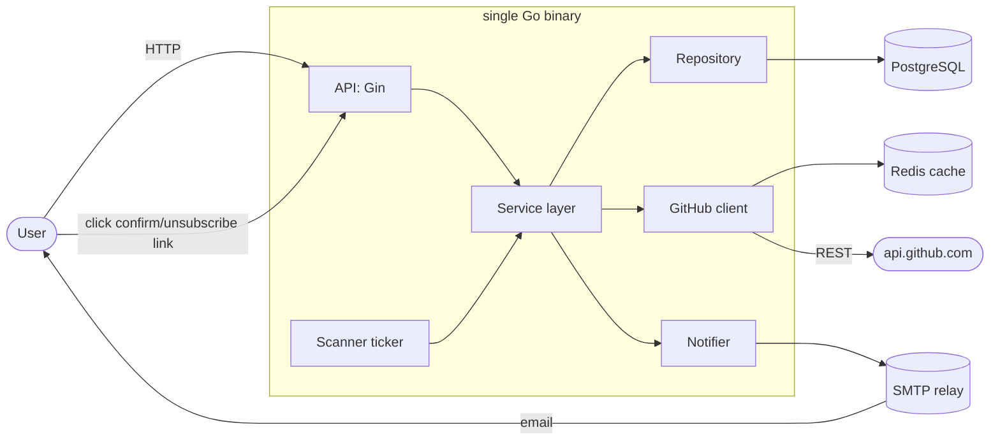
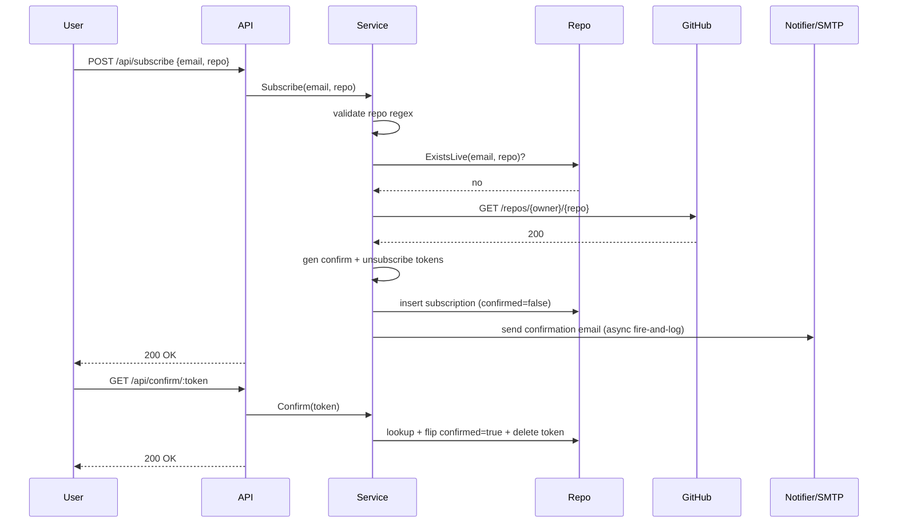
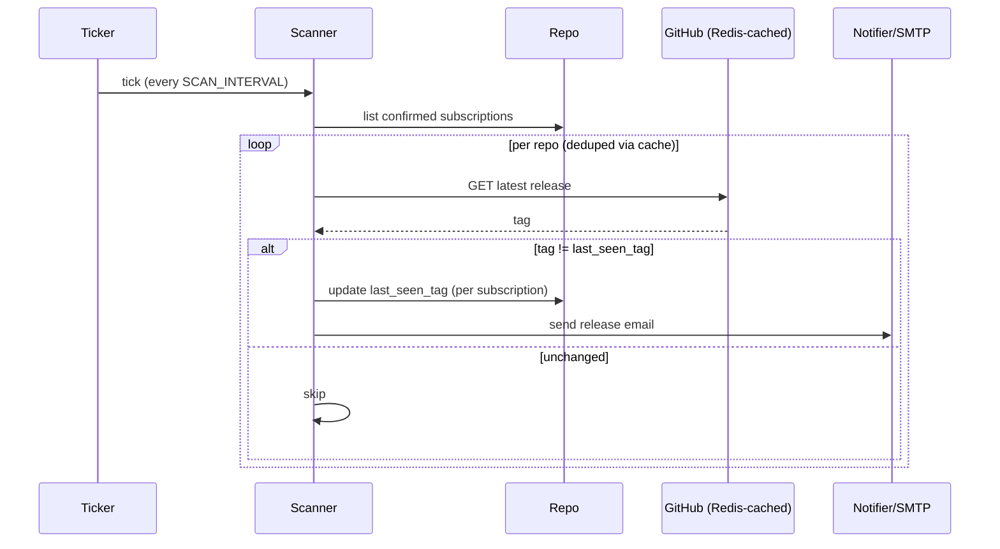
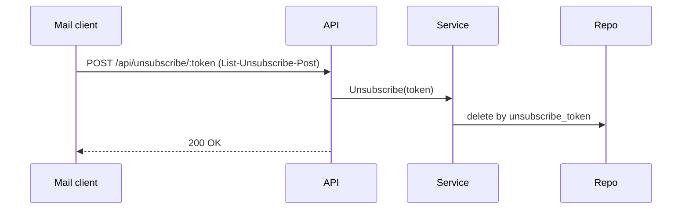

# System Design - RelEasely

## 1. Overview

A small Go service that lets users subscribe by email to GitHub release notifications for a chosen public repository. Users confirm via a link in a confirmation email; a background scanner polls GitHub on a fixed interval and emails subscribers when a new release tag appears.

Single binary. PostgreSQL is the source of truth. Redis caches GitHub API responses. SMTP delivers mail. No external queue, no microservices.

---

## 2. Goals & Non-Goals

**Goals**
- Reliable delivery of release notifications for any public GitHub repository.
- Bounded notification latency (target ≤ 1 polling interval after release publication).
- Self-service subscribe / confirm / unsubscribe with double opt-in.
- Survive GitHub rate-limit pressure and transient SMTP failures without losing subscriber state.
- Operable by one engineer; debuggable from container logs and `psql`.

**Non-Goals**
- Per-asset, per-tag-prefix, or pre-release filtering.
- Push channels other than email (no Slack, no webhook fan-out).
- Private repository support.
- Multi-region active/active.
- Full at-least-once delivery guarantees with retry queues - see §9.

---

## 3. SLOs & Capacity

| Dimension | Target |
|---|---|
| API availability | 99.5% monthly |
| API p99 latency | < 200 ms (excluding GitHub upstream calls) |
| Notification latency | ≤ `SCAN_INTERVAL` + 60 s p95 |
| Email delivery success | ≥ 99% (excluding hard bounces) |

**Capacity envelope** (single instance, single `GITHUB_TOKEN`). With `R = 5 000 req/h` (GitHub authenticated limit), `I` = scan interval in minutes, `H = 0.8` headroom for subscribe-time validation calls, and `E` = ETag-304 hit ratio, the maximum distinct tracked repos is `N = R × H / (1 − E) / (60 / I)`.

| `SCAN_INTERVAL` | ETag hit ratio | Max distinct repos |
|---|---|---|
| 5 min | 0 (today) | ≈ **333** |
| 5 min | 0.95 (post-ETag) | ≈ **6 666** |
| 15 min | 0 | ≈ **1 000** |

Subscribers scale independently (DB rows, SMTP fan-out). The ceiling is **distinct repos**, not subscribers. See §10.

---

## 4. High-Level Architecture



**Layering** is strict: handlers parse HTTP, services own business logic, repositories own SQL. Handlers never touch GORM; services never see `gin.Context`.

---

## 5. Components

| Component | Responsibility | Key dependencies |
|---|---|---|
| **API** (`internal/api`) | HTTP routing, input parsing, domain-error → HTTP-status mapping, HTML subscription page, `/health`. | Gin |
| **Service** (`internal/service`) | All business logic: validation, token generation, orchestration of repo + GitHub + notifier. Raises domain sentinel errors. | none (depends on consumer-defined interfaces) |
| **Repository** (`internal/repository`) | SQL via GORM. No business logic. Returns ORM models. | GORM |
| **GitHub client** (`internal/github`) | Authenticated REST calls; rate-limit handling; optional Redis cache wrapper. | net/http, Redis |
| **Scanner** (`internal/scanner`) | Ticker-driven goroutine; iterates confirmed subs, polls GitHub, updates `last_seen_tag`, hands off new releases to the notifier. | service, GitHub client |
| **Notifier** (`internal/notifier`) | SMTP send; embedded HTML + plaintext templates; `List-Unsubscribe` headers. | net/smtp |
| **Composition root** (`cmd/server/main.go`) | Wires everything; owns graceful shutdown. | all of the above |

### 5.1 Scanner concurrency contract

- **Bounded fan-out.** Each tick processes repos through a worker pool of size `SCAN_CONCURRENCY` (default 8). One in-flight GitHub call per repo at a time.
- **Per-call deadline.** Every GitHub request runs under `context.WithTimeout(GITHUB_TIMEOUT)` (default 10 s). A hung repo cannot stall the tick.
- **Per-tick budget.** Total tick duration is bounded by `SCAN_INTERVAL`; if a tick exceeds `0.8 × SCAN_INTERVAL`, the next tick is skipped rather than queued.
- **Single-owner invariant.** Exactly one process runs the scanner. Today the deployment is single-replica, so the invariant holds by construction. Stage 2 of §10 introduces a Postgres advisory-lock leader election (`pg_try_advisory_lock`) so workers without the lock idle.

---

## 6. Data Model

See **ADR-001 - Primary Datastore** for the ER diagram and datastore rationale. Summary:

- `subscriptions(id, email, repo, confirmed, last_seen_tag, unsubscribe_token, created_at, updated_at)`
- `confirmation_tokens(id, token, subscription_id FK ON DELETE CASCADE, created_at)`
- Unique index on `(email, repo)`. Unsubscribe hard-deletes the row, so re-subscribe after unsubscribe just inserts a fresh row.

`last_seen_tag` is the **dedup key**: a release is "new" iff GitHub reports a tag different from the one persisted on the subscription row. This makes the notification path effectively at-most-once per `(subscription, tag)` - see §9 for the failure modes this admits.

---

## 7. API Contract

Authoritative source: `swagger.yaml`. Summary:

| Method | Path | Purpose | Notable error mapping |
|---|---|---|---|
| `POST` | `/api/subscribe` | Create unconfirmed subscription, send confirmation email | 400 invalid repo, 404 repo missing, 409 duplicate, 503 GitHub rate-limited |
| `GET` | `/api/confirm/:token` | Set `confirmed=true`, delete token | 404 token unknown |
| `GET` / `POST` | `/api/unsubscribe/:token` | Delete subscription | 404 token unknown |
| `GET` | `/api/subscriptions` | List active subs for an email | 400 invalid email |
| `GET` | `/health` | Liveness | - |
| `GET` | `/` | HTML subscription form | - |

`POST` on unsubscribe exists to satisfy RFC 8058 one-click unsubscribe headers in outgoing mail.

---

## 8. Key Flows

### 8.1 Subscribe + confirm



SMTP failure on subscribe is logged, **not** propagated - the row exists, the user can request a resend or use the link directly when delivery recovers.

### 8.2 Scan + notify



### 8.3 One-click unsubscribe



---

## 9. Failure Modes

| Failure | Behavior today | Mitigation / future |
|---|---|---|
| GitHub 5xx / timeout | Scanner logs and moves on; subscribe API returns 503 | Per-repo exponential backoff. |
| GitHub 429 / rate-limit | Subscribe → 503; scanner skips tick | ETag / `If-None-Match` to avoid burning budget on unchanged repos. |
| SMTP down at subscribe | Row persisted, error logged; user can use the link directly when delivery recovers | Outbox + retry worker (ADR-006). |
| SMTP failure during scan | See §9.1 for the ordering discussion | Outbox flips at-most-once to at-least-once. |
| Scanner crash mid-tick | Tag-per-subscription update is row-local - restart resumes cleanly | - |
| Tag changes twice within one interval | Intermediate release is lost | Acceptable per current SLO. |
| Scan duration > interval | Ticks pile up | Bound concurrency; alert on `scan_duration > 0.8 × SCAN_INTERVAL`. |

### 9.1 Tag-advance vs. email-send ordering

The scan-and-notify path has two side effects per `(subscription, new_tag)`: persisting `last_seen_tag` and sending the release email. Postgres and SMTP cannot be committed atomically, so the order in which we do these two things is a design choice with a known tradeoff, not an oversight to fix later.

**Today: persist-then-send (at-most-once-per-tag).**

```
1. compare GitHub tag to last_seen_tag → "new"
2. UPDATE subscriptions SET last_seen_tag = T  ← committed first
3. notifier.Send(release email for T)          ← best-effort
```

Failure modes this admits:

- **SMTP fails or process crashes after step 2.** Tag is committed, mail never sent. The user misses *that* release; future releases arrive normally. Loss, not duplication.
- **Tag changes twice within one `SCAN_INTERVAL`.** Only the latest tag is observed; intermediate releases are lost.

The tradeoff is intentional. Duplicate emails damage deliverability - recipients mark them as spam, which lowers domain reputation for every other subscriber. A lost release notification can still be found on the GitHub release feed.

**Upgrade path: outbox + retry worker (at-least-once).** When loss becomes worse than duplication:

```
1. BEGIN
2. UPDATE subscriptions SET last_seen_tag = T
3. INSERT INTO outbox (subscription_id, tag, payload) VALUES (...)
4. COMMIT
5. outbox worker drains, sends, marks delivered (or retries with backoff)
```

The transactional `UPDATE + INSERT` makes the persisted-but-unsent state durable. Idempotency comes from a unique constraint on `(subscription_id, tag)` in the outbox so retries can't fan out duplicate sends. Full design in ADR-006.

---

## 10. Scaling Plan

Current shape is **one process, one scanner**. Each stage has a concrete trigger - escalate when *any* trigger fires, not on a calendar.

1. **Vertical + ETag.** Bigger box, larger Postgres pool, ETag/`If-None-Match` on the GitHub client.
   *Trigger:* distinct-repo count > 250, **or** p95 `scan_duration` > 0.5 × `SCAN_INTERVAL`, **or** GitHub `rate_limit_remaining` < 20% at end of tick.
2. **Hot-standby HA.** 2+ API replicas behind an LB; one scanner active via Postgres advisory-lock leader election.
   *Trigger:* single-replica deploy has caused user-visible downtime, **or** distinct-repo count > 1 000 (post-ETag).
3. **Sharded scanners or hybrid push/pull.** Partition subscriptions by `hash(repo) mod N` with per-shard GitHub tokens, or accept opt-in webhooks for cooperating repos. Both stages are far enough out that detailed design can wait. *Trigger:* distinct-repo count > 5 000 (post-ETag), or rate-limit budget dominated by a handful of repos.

---

## 11. Security & Privacy

- **Tokens.** UUID v4, opaque (not signed). Separate confirm and unsubscribe tokens. Confirm tokens are one-shot and deleted on use. Unsubscribe tokens are long-lived (must survive in mail clients) and revoked when the subscription row is deleted. See ADR-005 for the full rationale, including future work (TTL/sweeper, constant-time compare, Referrer-Policy).
- **Abuse / email-bombing - known gap.** `POST /api/subscribe` is the only unauthenticated write endpoint that triggers an outbound side effect (confirmation mail to a user-supplied address). It is **not currently rate-limited.** The confirm-token TTL bounds unconfirmed-row growth, but does not stop an attacker from flooding a victim's inbox. If this becomes a real problem, the standard mitigations are a per-IP token bucket on subscribe, a per-email cooldown (independent of IP, returning the same response shape whether the mail was sent or suppressed), and a CAPTCHA on the HTML form.
- **Auth.** The public subscribe / confirm / unsubscribe endpoints are intentionally open. Optional `X-API-Key` (constant-time compared) gates admin/list endpoints.
- **Inputs.** `repo` matched against `^[a-zA-Z0-9._-]+/[a-zA-Z0-9._-]+$` before any external call. Email validated by `net/mail`.
- **SQL.** Parameterized through GORM; no string-concatenated queries.
- **Secrets.** GitHub token, SMTP creds, API key via env / secret manager only. Never logged.
- **PII.** Only email is collected. Unsubscribe hard-deletes the row, so the email is physically removed - no tombstone retention to reconcile against erasure requests.
- **Network.** No inbound webhook endpoint - outbound only - reduces attack surface vs. a push-based design (see ADR-002).

---

## 12. Observability

- **Logs.** Structured JSON (stdlib `log/slog` or equivalent), request IDs propagated through service calls. Tokens, full email addresses, raw HTTP bodies, SMTP credentials, and GitHub tokens must never appear in logs; if an email needs to be referenced, log it as `u***@example.com`.
- **Health.** `GET /health` returns 200 if process is up; `GET /ready` (proposed) checks DB + Redis reachability so a dependency blip drains the replica from the LB instead of restarting it.
- **Metrics worth adding** (Prometheus). Label cardinality must be bounded - no label may take a user-controlled high-cardinality value (no email, no IP, no token, no full URL):
  - `scan_duration_seconds` (histogram)
  - `github_requests_total{status}`, `github_rate_limit_remaining`
  - `smtp_send_total{outcome}`, `smtp_send_duration_seconds`
  - `subscriptions_active`, `subscriptions_pending_confirmation`
- **Alerts.** Pages on: scanner missed > 2 ticks, GitHub 429 rate > 5%/min, SMTP failure rate > 5%/min, DB connection saturation > 80%.
- **Tracing.** Not used; correlated request-ID logs cover the same questions for a single binary.

---

## 13. Open Questions

1. Per-subscription pre-release / draft filtering - is the data model ready, or do we need a `release_filter` column?
2. ETag-based caching layer - worth the complexity, or is plain TTL caching enough at current scale? See ADR-002 Future Work for the cost/benefit numbers.
3. Outbox pattern for SMTP - do we have a real duplicate problem yet, or is this premature? Pending ADR.
4. Bounce / suppression handling - do we ingest DSN reports, maintain a suppression list, and auto-delete after a bounce threshold? Defer until bounce rate becomes measurable.

---

## 14. Configuration

All configuration is via environment variables (12-factor). No config files.

**Implemented today:**

| Variable | Default | Notes |
|---|---|---|
| `PORT` | `8080` | HTTP server port. |
| `BASE_URL` | `http://localhost:8080` | Origin used to build confirm/unsubscribe links in emails. |
| `DB_*` (`HOST`/`PORT`/`USER`/`PASSWORD`/`NAME`/`SSLMODE`) | - / `5432` / - / - / - / `disable` | Postgres connection. SSL `require` in production. |
| `REDIS_URL` | unset | When unset, GitHub client runs without caching. |
| `GITHUB_TOKEN` | unset | Without this, scanner uses GitHub's 60 req/h unauthenticated limit. |
| `SMTP_*` (`HOST`/`PORT`/`USERNAME`/`PASSWORD`) | - / `587` / - / - | Required. STARTTLS on 587 or implicit TLS on 465. |
| `SCAN_INTERVAL` | `5m` | Lower bound `1m`; upper bound `1h`. |
| `SCAN_CONCURRENCY` | `8` | Worker-pool size per tick (§5.1). |
| `GITHUB_TIMEOUT` | `10s` | Per-call deadline for GitHub requests (§5.1). |
| `API_KEY` | unset | When set, gates admin endpoints via `X-API-Key`. |

**Proposed (referenced elsewhere in this doc, not yet wired):** `CONFIRM_TOKEN_TTL` (§11), `SUBSCRIBE_RATE_LIMIT` (§11).

---

## 15. Deployment & Runtime

- **Image.** Multi-stage Dockerfile (Go build → distroless runtime). Static binary, stripped. See `Dockerfile`.
- **Compose.** `docker-compose.yml` brings up Postgres + Redis + app for local dev. The container entrypoint runs `migrate up` before exec'ing the binary; the app waits on DB and Redis healthchecks before starting.
- **Replicas.** Today: 1. Running more than one requires the advisory-lock leader election in §5.1; until then, the single-owner scanner invariant holds only at one replica. API replicas are otherwise stateless behind any L4/L7 load balancer.
- **Probes.** `GET /health` for liveness (process is up). `GET /ready` (proposed) for readiness - 200 only if DB and (when configured) Redis are reachable.
- **Graceful shutdown.** SIGTERM → stop accepting new HTTP, drain in-flight requests with deadline `SHUTDOWN_TIMEOUT` (default 30 s), stop the scanner ticker, flush in-flight SMTP sends, close the DB pool. Owned by `cmd/server/main.go`.

---

## 16. Reference Documents

- Architecture Decision Records - `docs/adr/`. Filenames describe the decision topic (`XXX-decision-topic.md`); see `docs/adr/README.md` for naming and status conventions.
- API contract - `swagger.yaml`.
- Runtime / setup - `README.md`.
